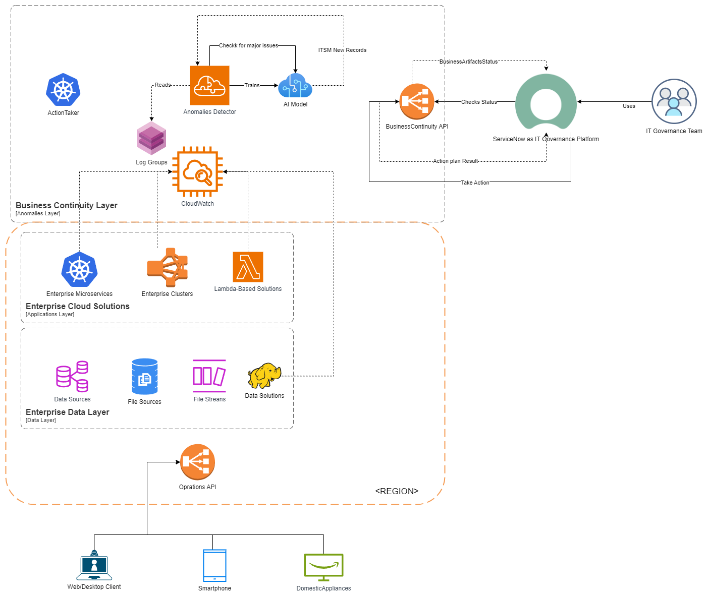
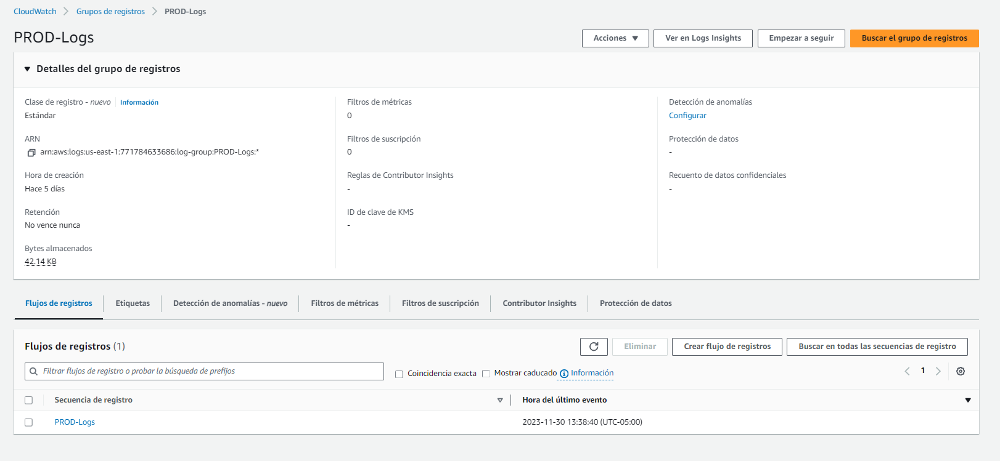
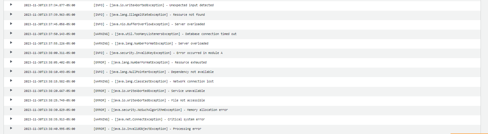

# Random Log Generator

## Resumen
Este repositorio contiene el artefacto que permite alimentar el servicio de AWS cloudwatch de logs. Utilizado para realizar pruebas sobre la arquitectura del prótotipo del detector de anómalias multicloud propuesto. 

## Detalles técnicos del proyecto
- [Java 8](https://www.oracle.com/co/java/technologies/javase/javase8-archive-downloads.html)
- [Maven](https://maven.apache.org/)
- [AWS SDK](https://aws.amazon.com/es/sdk-for-java/)
- [Docker](https://www.docker.com/)


## Features
- Generación aleatoria de excepciones a diferentes niveles de criticidad.

Esta solución le será útil en el escenario de requerir simular sistemas en estado de ejecución y su generación espontanéa de errores o excepciones para posteriormente utilizar estas entradas en componentes que las procesen y tomen acciones de resiliciencia, recuperación, clasificación o análisis.  

## Vista de Arquitectura


- Esta solución representa la generación espontanéa de errores de la capa de aplicaciones y datos de una gran corporación. 

## Instalación

- Debe contar con Maven instalado y configuado en su entorno local. [Configurar](https://maven.apache.org/install.html)
- Debe tener configurado su entorno de despliegue AWS en AWS CLI local [Configurar](https://docs.aws.amazon.com/cli/latest/userguide/cli-chap-configure.html).
- Debe tener docker instalado y configurado cómo servicio en su maquina local. [Configurar](https://docs.docker.com/engine/install/)
- Deberá Reemplazar sus credenciales de AWS en el archivo Dockerfile (Por razones de seguridad se recomienda ampliamente que no invoque instrucciones push a su repositorio local/remoto de git con estos párametros configurados, pues sus credenciales de AWS podrían resultar ex-filtradas)
```dockerfile 
FROM openjdk:11

# Set the working directory in the container
WORKDIR /app

COPY target/log-generator-1.0.jar /app/log-generator-1.0.jar

COPY aws.properties /app/aws.properties

# Set AWS credentials and region as environment variables
ENV AWS_ACCESS_KEY_ID=<you access key id>
ENV AWS_SECRET_ACCESS_KEY=<you access secret key>
ENV AWS_DEFAULT_REGION=<you default region>

# Run the Java application
CMD ["java", "-jar", "log-generator-1.0.jar"]
```

- En el archivo aws.properties, defina en que grupo de registros de logs el generador va a publicar mensajes. 
```properties
# aws.properties
aws.region=us-east-1
aws.logGroupName=PROD-Logs
```

- Hacer el build de la solución utilizando el siguiente comando.
```bash 
mvn clean install
```

- Construya la imagen de docker con el siguiente comando

```bash 
docker build -t random-log-generator .
```
- Ejecuté la solución con el siguiente comando. 

```bash
docker run random-log-generator
```

- Debería ver cómo en su servicio de cloud watch se ha abierto un nuevo grupo (En caso de que no existiese) de registros de logs, en caso de haber definido un grupo de logs existente debería observar cómo se comienzan a generar nuevas entradas con detalles aleatorios.  




